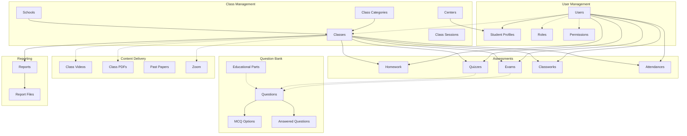
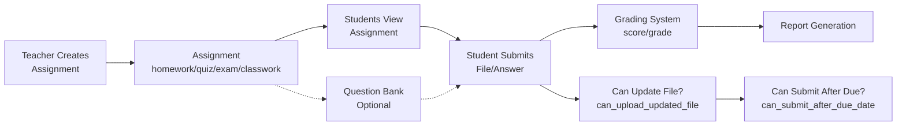

# Entity Relationship Diagram (ERD)
## husseinkhalid-backend Database

---

## Visual ERD Diagram

```mermaid
erDiagram
    %% Core User & Auth System
    users ||--o| student_profiles : "has"
    users ||--o{ device_tokens : "has"
    users ||--o{ t_a_notes : "has"
    users ||--o{ t_a_transfers : "has"
    users ||--o{ t_a_droppeds : "has"
    users ||--o{ video_views : "tracks"
    users ||--o{ answered_questions : "answers"
    users ||--o{ report_files : "owns"
    users }o--|| roles : "has main role"
    users }o--o{ roles : "model_has_roles"
    users }o--o{ permissions : "model_has_permissions"
    users }o--o{ classes : "class_user"
    
    %% Schools & Centers
    schools ||--o{ classes : "has"
    centers ||--o{ student_profiles : "has"
    centers ||--o{ center_notes : "has"
    
    %% Class System
    class_categories ||--o{ classes : "categorizes"
    class_categories ||--o{ past_paper_categories : "has"
    class_categories ||--o{ events : "has"
    class_categories ||--o{ educational_parts : "has"
    classes ||--|| schools : "belongs to"
    classes ||--|| class_categories : "belongs to"
    classes ||--o{ class_sessions : "has"
    classes ||--o{ attendances : "has"
    classes ||--o{ homework : "has"
    classes ||--o{ quizzes : "has"
    classes ||--o{ exams : "has"
    classes ||--o{ classworks : "has"
    classes ||--o{ reports : "generates"
    classes }o--o{ class_videos : "class_video_pivot"
    classes }o--o{ class_pdfs : "class_pdf_pivot"
    classes }o--o{ zoom : "zoom_classes"
    
    %% Student Profiles
    student_profiles ||--|| users : "extends"
    student_profiles }o--|| centers : "belongs to"
    
    %% Attendance System
    attendances ||--o{ attendance_students : "tracks"
    attendance_students }o--|| users : "student"
    
    %% Homework System
    homework ||--o{ homework_students : "has submissions"
    homework_students }o--|| users : "student"
    
    %% Quiz System
    quizzes ||--o{ quiz_students : "has submissions"
    quizzes ||--o{ quiz_gradings : "has grading"
    quiz_students }o--|| users : "student"
    quiz_gradings }o--|| quizzes : "belongs to"
    
    %% Exam System
    exams ||--o{ exam_students : "has submissions"
    exams ||--o{ exam_gradings : "has grading"
    exam_students }o--|| users : "student"
    exam_gradings }o--|| exams : "belongs to"
    
    %% Classwork System
    classworks ||--o{ classwork_students : "has submissions"
    classworks ||--o{ classwork_gradings : "has grading"
    classwork_students }o--|| users : "student"
    classwork_gradings }o--|| classworks : "belongs to"
    
    %% Content System
    class_videos ||--o{ video_views : "tracked by"
    past_paper_categories ||--o{ past_papers : "contains"
    
    %% Question Bank System
    questions ||--o{ mcq_options : "has options"
    questions ||--o{ answered_questions : "has answers"
    questions }o--o{ educational_parts : "question_educational_parts"
    questions }o--o{ exams : "exam_questions (polymorphic)"
    questions }o--o{ quizzes : "exam_questions (polymorphic)"
    mcq_options }o--o{ answered_questions : "answered_question_options"
    
    %% Reports System
    reports ||--o{ report_files : "has files"
    reports }o--o| users : "for user"
    reports }o--o| classes : "for class"
    
    %% Supervisor-Teacher
    users ||--o{ supervisor_teachers : "supervises as supervisor"
    users ||--o{ supervisor_teachers : "supervised as teacher"
    
    %% Roles & Permissions
    roles ||--o{ permissions : "role_has_permissions"
    
    %% Entity Definitions
    users {
        bigint id PK
        string name
        string nickname
        string email UK
        string phone UK
        enum gender
        string password
        string avatar
        string zoom_id
        boolean is_active
        date birth_date
        bigint main_role_id FK
        bigint created_by
        string disk
        timestamp deleted_at
        timestamps
    }
    
    student_profiles {
        bigint id PK
        bigint user_id FK
        string facebook_url
        string facebook_name
        string mother_name
        string mother_email
        string mother_phone
        string father_name
        string father_email
        string father_phone
        string school_name
        enum student_type
        bigint center_id FK
        string code
        timestamps
    }
    
    schools {
        bigint id PK
        string name
        string principle_name
        string principle_email
        timestamps
    }
    
    centers {
        bigint id PK
        string name
        timestamps
    }
    
    class_categories {
        bigint id PK
        string name
        string code
        timestamps
    }
    
    classes {
        bigint id PK
        string name
        decimal fees
        string type
        bigint school_id FK
        bigint category_id FK
        boolean is_ranked
        boolean automatic_reporting
        date start_date
        date end_date
        integer sort_order
        timestamps
    }
    
    class_sessions {
        bigint id PK
        bigint class_id FK
        enum weekday
        time start_time
        timestamps
    }
    
    attendances {
        bigint id PK
        string name
        string qr_code
        bigint class_id FK
        date date
        integer sort_order
        timestamp deleted_at
        timestamps
    }
    
    attendance_students {
        bigint id PK
        bigint attendance_id FK
        bigint student_id FK
        boolean is_present
        timestamp deleted_at
        timestamps
    }
    
    homework {
        bigint id PK
        string name
        bigint class_id FK
        decimal max_score
        string file
        date date
        datetime due_date
        string disk
        integer sort_order
        timestamp deleted_at
        timestamps
    }
    
    homework_students {
        bigint id PK
        bigint homework_id FK
        bigint student_id FK
        decimal score
        string file
        string updated_file
        string corrected_file
        string status
        boolean can_upload_updated_file
        boolean can_submit_after_due_date
        timestamp submitted_at
        text notes
        string disk
        timestamp deleted_at
        timestamps
    }
    
    quizzes {
        bigint id PK
        string name
        bigint class_id FK
        decimal max_score
        date date
        datetime due_date
        string grading_type
        string pdf
        integer sort_order
        timestamp deleted_at
        timestamps
    }
    
    quiz_students {
        bigint id PK
        bigint quiz_id FK
        bigint student_id FK
        decimal score
        string file
        string updated_file
        boolean is_finished
        boolean can_upload_updated_file
        boolean can_submit_after_due_date
        timestamp submitted_at
        text notes
        string disk
        timestamp deleted_at
        timestamps
    }
    
    quiz_gradings {
        bigint id PK
        bigint quiz_id FK
        string grade
        decimal from
        decimal to
    }
    
    exams {
        bigint id PK
        string name
        bigint class_id FK
        decimal max_score
        date date
        datetime due_date
        string grading_type
        string pdf
        integer sort_order
        timestamp deleted_at
        timestamps
    }
    
    exam_students {
        bigint id PK
        bigint exam_id FK
        bigint student_id FK
        decimal score
        string file
        string updated_file
        boolean is_finished
        boolean can_upload_updated_file
        boolean can_submit_after_due_date
        timestamp submitted_at
        text notes
        string disk
        timestamp deleted_at
        timestamps
    }
    
    exam_gradings {
        bigint id PK
        bigint exam_id FK
        string grade
        decimal from
        decimal to
    }
    
    classworks {
        bigint id PK
        string name
        bigint class_id FK
        decimal max_score
        date date
        datetime due_date
        string grading_type
        string pdf
        string disk
        integer sort_order
        timestamp deleted_at
        timestamps
    }
    
    classwork_students {
        bigint id PK
        bigint classwork_id FK
        bigint student_id FK
        decimal score
        string file
        string updated_file
        boolean is_finished
        string status
        text notes
        string disk
        timestamp deleted_at
        timestamps
    }
    
    classwork_gradings {
        bigint id PK
        bigint classwork_id FK
        string grade
        decimal from
        decimal to
    }
    
    class_videos {
        bigint id PK
        bigint class_id FK
        string title
        string video
        string type
        uuid video_id
        enum status
        text message
        string disk
        integer sort_order
        string sub_folder
        string thumbnail
        integer duration
        boolean is_secure
        text embedded_html
        timestamps
    }
    
    video_views {
        bigint id PK
        bigint video_id FK
        bigint user_id FK
        float progress
        timestamps
    }
    
    class_pdfs {
        bigint id PK
        string title
        string pdf
        string type
        string disk
        string sub_folder
        integer sort_order
        timestamps
    }
    
    presentations {
        bigint id PK
        string title
        string file
        enum type
        integer size
        timestamps
    }
    
    past_paper_categories {
        bigint id PK
        string name
        bigint class_category_id FK
        timestamps
    }
    
    past_papers {
        bigint id PK
        string name
        string file
        bigint category_id FK
        string disk
        timestamps
    }
    
    educational_parts {
        bigint id PK
        string name
        bigint class_category_id FK
        timestamp deleted_at
        timestamps
    }
    
    questions {
        bigint id PK
        string type
        string text
        decimal points
        integer complexity
        timestamp deleted_at
        timestamps
    }
    
    mcq_options {
        bigint id PK
        bigint question_id FK
        string text
        integer order
        timestamps
    }
    
    answered_questions {
        bigint id PK
        bigint question_id FK
        bigint user_id FK
        text text_answer
        integer score
        string examable_type
        bigint examable_id
        timestamps
    }
    
    exam_questions {
        bigint id PK
        string examable_type
        bigint examable_id
        bigint question_id FK
        integer order
        timestamps
    }
    
    reports {
        bigint id PK
        string type
        bigint user_id FK
        bigint class_id FK
        enum status
        string file
        string disk
        date from_date
        date to_date
        timestamps
    }
    
    report_files {
        bigint id PK
        bigint user_id FK
        bigint report_id FK
        string file
        string file_disk
        timestamps
    }
    
    t_a_notes {
        bigint id PK
        bigint user_id FK
        text note
        timestamps
    }
    
    t_a_transfers {
        bigint id PK
        bigint user_id FK
        text note
        timestamps
    }
    
    t_a_droppeds {
        bigint id PK
        bigint user_id FK
        text note
        string reason
        timestamps
    }
    
    center_notes {
        bigint id PK
        bigint center_id FK
        text text
        timestamps
    }
    
    events {
        bigint id PK
        bigint class_category_id FK
        string name
        text description
        datetime start_at
        timestamps
    }
    
    supervisor_teachers {
        bigint id PK
        bigint supervisor_id FK
        bigint teacher_id FK
        timestamps
    }
    
    zoom {
        bigint id PK
        string topic
        string meeting_id
        enum main_type
        string type
        text agenda
        string join_url
        string password
        integer duration
        datetime start_time
        boolean has_integration
        timestamps
    }
    
    device_tokens {
        bigint id PK
        bigint user_id FK
        string token UK
        timestamps
    }
    
    import_export_requests {
        bigint id PK
        string type
        string file_name
        string status
        string entity_type
        string url
        longtext error_message
        longtext errors
        json error_json
        bigint user_id
        string disk
        integer progress
        integer current_row
        integer total_rows
        timestamp deleted_at
        timestamps
    }
    
    settings {
        bigint id PK
        string key UK
        text value
        timestamps
    }
    
    roles {
        bigint id PK
        string name
        string guard_name
        timestamps
    }
    
    permissions {
        bigint id PK
        string name
        string display_name
        string group_name
        string guard_name
        timestamps
    }
```

---

## Simplified Domain View



---

## Assessment Submission Flow



---

## Complete Database Schema Details

### **Core Entities**

#### **users**
Primary user table for all user types (students, teachers, supervisors, admins)

**Fields:**
- `id` BIGINT PRIMARY KEY
- `name` VARCHAR - Full name
- `nickname` VARCHAR - Display name
- `email` VARCHAR UNIQUE - Email address
- `phone` VARCHAR UNIQUE - Phone number
- `gender` ENUM('male', 'female')
- `password` VARCHAR - Hashed password
- `avatar` VARCHAR NULLABLE - Profile picture path
- `zoom_id` VARCHAR NULLABLE - Zoom user ID
- `is_active` BOOLEAN DEFAULT false
- `birth_date` DATE NULLABLE
- `main_role_id` BIGINT FK → roles - Primary role
- `created_by` BIGINT NULLABLE - Created by user ID
- `disk` VARCHAR NULLABLE - Storage disk for avatar
- `email_verified_at` TIMESTAMP NULLABLE
- `deleted_at` TIMESTAMP NULLABLE - Soft delete
- `created_at`, `updated_at` TIMESTAMP

**Relationships:**
- has_one → `student_profiles`
- has_many → `device_tokens`, `t_a_notes`, `t_a_transfers`, `t_a_droppeds`
- has_many → `answered_questions`, `video_views`, `report_files`
- belongs_to → `roles` (main_role_id)
- belongs_to_many → `classes` (via `class_user`)
- belongs_to_many → `roles` (via `model_has_roles`)
- belongs_to_many → `permissions` (via `model_has_permissions`)

---

#### **student_profiles**
Extended information for student users

**Fields:**
- `id` BIGINT PRIMARY KEY
- `user_id` BIGINT FK → users UNIQUE
- `facebook_url` VARCHAR NULLABLE
- `facebook_name` VARCHAR NULLABLE
- `mother_name` VARCHAR NULLABLE
- `mother_email` VARCHAR NULLABLE
- `mother_phone` VARCHAR NULLABLE
- `father_name` VARCHAR NULLABLE
- `father_email` VARCHAR NULLABLE
- `father_phone` VARCHAR NULLABLE
- `school_name` VARCHAR - Current school
- `student_type` ENUM('school', 'center')
- `center_id` BIGINT FK → centers NULLABLE
- `code` VARCHAR NULLABLE - Student code
- `created_at`, `updated_at` TIMESTAMP

**Relationships:**
- belongs_to → `users`
- belongs_to → `centers`

---

#### **schools**
Educational institutions

**Fields:**
- `id` BIGINT PRIMARY KEY
- `name` VARCHAR - School name
- `principle_name` VARCHAR NULLABLE - Principal's name
- `principle_email` VARCHAR NULLABLE - Principal's email
- `created_at`, `updated_at` TIMESTAMP

**Relationships:**
- has_many → `classes`

---

#### **centers**
Learning centers

**Fields:**
- `id` BIGINT PRIMARY KEY
- `name` VARCHAR - Center name
- `created_at`, `updated_at` TIMESTAMP

**Relationships:**
- has_many → `student_profiles`
- has_many → `center_notes`

---

#### **class_categories**
Categories/levels for classes (e.g., AS Level, A Level, IGCSE)

**Fields:**
- `id` BIGINT PRIMARY KEY
- `name` VARCHAR - Category name
- `code` VARCHAR - Category code
- `created_at`, `updated_at` TIMESTAMP

**Relationships:**
- has_many → `classes`
- has_many → `past_paper_categories`
- has_many → `events`
- has_many → `educational_parts`

---

#### **classes**
Courses/Classes

**Fields:**
- `id` BIGINT PRIMARY KEY
- `name` VARCHAR - Class name
- `fees` DECIMAL NULLABLE - Course fee
- `type` VARCHAR NULLABLE - Class type
- `school_id` BIGINT FK → schools NULLABLE
- `category_id` BIGINT FK → class_categories
- `is_ranked` BOOLEAN DEFAULT true - Show ranking
- `automatic_reporting` BOOLEAN DEFAULT false
- `start_date` DATE - Course start
- `end_date` DATE - Course end
- `sort_order` INTEGER NULLABLE
- `created_at`, `updated_at` TIMESTAMP

**Relationships:**
- belongs_to → `schools`
- belongs_to → `class_categories`
- has_many → `class_sessions`, `attendances`, `homework`, `quizzes`, `exams`, `classworks`, `reports`
- belongs_to_many → `users` (via `class_user`)
- belongs_to_many → `class_videos` (via `class_video_pivot`)
- belongs_to_many → `class_pdfs` (via `class_pdf_pivot`)
- belongs_to_many → `zoom` (via `zoom_classes`)

---

#### **class_sessions**
Weekly scheduled sessions for classes

**Fields:**
- `id` BIGINT PRIMARY KEY
- `class_id` BIGINT FK → classes
- `weekday` ENUM('Sunday', 'Monday', 'Tuesday', 'Wednesday', 'Thursday', 'Friday', 'Saturday')
- `start_time` TIME
- `created_at`, `updated_at` TIMESTAMP

**Relationships:**
- belongs_to → `classes`

---

### **Assessment Entities**

#### **attendances**
Attendance records for class sessions

**Fields:**
- `id` BIGINT PRIMARY KEY
- `name` VARCHAR - Attendance session name
- `qr_code` VARCHAR NULLABLE - QR code for check-in
- `class_id` BIGINT FK → classes
- `date` DATE - Attendance date
- `sort_order` INTEGER NULLABLE
- `deleted_at` TIMESTAMP NULLABLE
- `created_at`, `updated_at` TIMESTAMP

**Relationships:**
- belongs_to → `classes`
- has_many → `attendance_students`

---

#### **attendance_students**
Individual student attendance records

**Fields:**
- `id` BIGINT PRIMARY KEY
- `attendance_id` BIGINT FK → attendances
- `student_id` BIGINT FK → users
- `is_present` BOOLEAN
- `deleted_at` TIMESTAMP NULLABLE
- `created_at`, `updated_at` TIMESTAMP

**Relationships:**
- belongs_to → `attendances`
- belongs_to → `users`

---

#### **homework**
Homework assignments

**Fields:**
- `id` BIGINT PRIMARY KEY
- `name` VARCHAR
- `class_id` BIGINT FK → classes
- `max_score` DECIMAL - Maximum points
- `file` VARCHAR NULLABLE - Assignment file
- `date` DATE - Assignment date
- `due_date` DATETIME NULLABLE
- `disk` VARCHAR NULLABLE - Storage disk
- `sort_order` INTEGER NULLABLE
- `deleted_at` TIMESTAMP NULLABLE
- `created_at`, `updated_at` TIMESTAMP

**Relationships:**
- belongs_to → `classes`
- has_many → `homework_students`

---

#### **homework_students**
Student homework submissions

**Fields:**
- `id` BIGINT PRIMARY KEY
- `homework_id` BIGINT FK → homework
- `student_id` BIGINT FK → users
- `score` DECIMAL NULLABLE - Achieved score
- `file` VARCHAR NULLABLE - Submission file
- `updated_file` VARCHAR NULLABLE - Resubmitted file
- `corrected_file` VARCHAR NULLABLE - Teacher corrections
- `status` VARCHAR NULLABLE
- `can_upload_updated_file` BOOLEAN DEFAULT false
- `can_submit_after_due_date` BOOLEAN DEFAULT true
- `submitted_at` TIMESTAMP NULLABLE
- `notes` TEXT NULLABLE - Teacher notes
- `disk` VARCHAR NULLABLE
- `deleted_at` TIMESTAMP NULLABLE
- `created_at`, `updated_at` TIMESTAMP

**Relationships:**
- belongs_to → `homework`
- belongs_to → `users`

---

#### **quizzes**
Quiz assignments

**Fields:**
- `id` BIGINT PRIMARY KEY
- `name` VARCHAR
- `class_id` BIGINT FK → classes
- `max_score` DECIMAL
- `date` DATE
- `due_date` DATETIME NULLABLE
- `grading_type` VARCHAR NULLABLE - 'points' or 'grade'
- `pdf` VARCHAR NULLABLE - Quiz PDF
- `sort_order` INTEGER NULLABLE
- `deleted_at` TIMESTAMP NULLABLE
- `created_at`, `updated_at` TIMESTAMP

**Relationships:**
- belongs_to → `classes`
- has_many → `quiz_students`
- has_many → `quiz_gradings`
- morph_many → `exam_questions` (as examable)

---

#### **quiz_students**
Student quiz submissions

**Fields:**
- `id` BIGINT PRIMARY KEY
- `quiz_id` BIGINT FK → quizzes
- `student_id` BIGINT FK → users
- `score` DECIMAL NULLABLE
- `file` VARCHAR NULLABLE
- `updated_file` VARCHAR NULLABLE
- `is_finished` BOOLEAN DEFAULT false
- `can_upload_updated_file` BOOLEAN DEFAULT false
- `can_submit_after_due_date` BOOLEAN DEFAULT true
- `submitted_at` TIMESTAMP NULLABLE
- `notes` TEXT NULLABLE
- `disk` VARCHAR NULLABLE
- `deleted_at` TIMESTAMP NULLABLE
- `created_at`, `updated_at` TIMESTAMP

**Relationships:**
- belongs_to → `quizzes`
- belongs_to → `users`

---

#### **quiz_gradings**
Grading scale for quizzes (e.g., A: 90-100, B: 80-89)

**Fields:**
- `id` BIGINT PRIMARY KEY
- `quiz_id` BIGINT FK → quizzes
- `grade` VARCHAR - Grade letter/name
- `from` DECIMAL - Min score
- `to` DECIMAL - Max score

**Relationships:**
- belongs_to → `quizzes`

---

#### **exams**
Exam assignments

**Fields:**
- `id` BIGINT PRIMARY KEY
- `name` VARCHAR
- `class_id` BIGINT FK → classes
- `max_score` DECIMAL DEFAULT 100
- `date` DATE
- `due_date` DATETIME NULLABLE
- `grading_type` VARCHAR NULLABLE
- `pdf` VARCHAR NULLABLE
- `sort_order` INTEGER NULLABLE
- `deleted_at` TIMESTAMP NULLABLE
- `created_at`, `updated_at` TIMESTAMP

**Relationships:**
- belongs_to → `classes`
- has_many → `exam_students`
- has_many → `exam_gradings`
- morph_many → `exam_questions` (as examable)

---

#### **exam_students**
Student exam submissions

**Fields:**
- `id` BIGINT PRIMARY KEY
- `exam_id` BIGINT FK → exams
- `student_id` BIGINT FK → users
- `score` DECIMAL NULLABLE
- `file` VARCHAR NULLABLE
- `updated_file` VARCHAR NULLABLE
- `is_finished` BOOLEAN DEFAULT false
- `can_upload_updated_file` BOOLEAN DEFAULT false
- `can_submit_after_due_date` BOOLEAN DEFAULT true
- `submitted_at` TIMESTAMP NULLABLE
- `notes` TEXT NULLABLE
- `disk` VARCHAR NULLABLE
- `deleted_at` TIMESTAMP NULLABLE
- `created_at`, `updated_at` TIMESTAMP

**Relationships:**
- belongs_to → `exams`
- belongs_to → `users`

---

#### **exam_gradings**
Grading scale for exams

**Fields:**
- `id` BIGINT PRIMARY KEY
- `exam_id` BIGINT FK → exams
- `grade` VARCHAR
- `from` DECIMAL
- `to` DECIMAL

**Relationships:**
- belongs_to → `exams`

---

#### **classworks**
Classwork assignments

**Fields:**
- `id` BIGINT PRIMARY KEY
- `name` VARCHAR
- `class_id` BIGINT FK → classes
- `max_score` DECIMAL DEFAULT 100
- `date` DATE
- `due_date` DATETIME NULLABLE
- `grading_type` VARCHAR NULLABLE
- `pdf` VARCHAR NULLABLE
- `disk` VARCHAR NULLABLE
- `sort_order` INTEGER NULLABLE
- `deleted_at` TIMESTAMP NULLABLE
- `created_at`, `updated_at` TIMESTAMP

**Relationships:**
- belongs_to → `classes`
- has_many → `classwork_students`
- has_many → `classwork_gradings`

---

#### **classwork_students**
Student classwork submissions

**Fields:**
- `id` BIGINT PRIMARY KEY
- `classwork_id` BIGINT FK → classworks
- `student_id` BIGINT FK → users
- `score` DECIMAL NULLABLE
- `file` VARCHAR NULLABLE
- `updated_file` VARCHAR NULLABLE
- `is_finished` BOOLEAN DEFAULT false
- `status` VARCHAR DEFAULT 'not_attended'
- `notes` TEXT NULLABLE
- `disk` VARCHAR NULLABLE
- `deleted_at` TIMESTAMP NULLABLE
- `created_at`, `updated_at` TIMESTAMP

**Relationships:**
- belongs_to → `classworks`
- belongs_to → `users`

---

#### **classwork_gradings**
Grading scale for classworks

**Fields:**
- `id` BIGINT PRIMARY KEY
- `classwork_id` BIGINT FK → classworks
- `grade` VARCHAR
- `from` DECIMAL
- `to` DECIMAL

**Relationships:**
- belongs_to → `classworks`

---

### **Content Entities**

#### **class_videos**
Video content for classes

**Fields:**
- `id` BIGINT PRIMARY KEY
- `class_id` BIGINT FK → classes NULLABLE
- `title` VARCHAR
- `video` VARCHAR NULLABLE - Video file path
- `type` VARCHAR NULLABLE - Video type
- `video_id` UUID NULLABLE - External video ID
- `status` ENUM('pending', 'transferring', 'uploaded', 'failed', 'ready') DEFAULT 'pending'
- `message` TEXT NULLABLE - Status message
- `disk` VARCHAR NULLABLE
- `sort_order` INTEGER NULLABLE
- `sub_folder` VARCHAR NULLABLE
- `thumbnail` VARCHAR NULLABLE
- `duration` INTEGER NULLABLE - Duration in seconds
- `is_secure` BOOLEAN DEFAULT true
- `embedded_html` TEXT NULLABLE
- `created_at`, `updated_at` TIMESTAMP

**Relationships:**
- belongs_to → `classes`
- has_many → `video_views`
- belongs_to_many → `classes` (via `class_video_pivot`)

---

#### **video_views**
Track student video viewing progress

**Fields:**
- `id` BIGINT PRIMARY KEY
- `video_id` BIGINT FK → class_videos
- `user_id` BIGINT FK → users
- `progress` FLOAT DEFAULT 0 - Progress percentage
- `created_at`, `updated_at` TIMESTAMP

**Relationships:**
- belongs_to → `class_videos`
- belongs_to → `users`

---

#### **class_pdfs**
PDF documents for classes

**Fields:**
- `id` BIGINT PRIMARY KEY
- `title` VARCHAR
- `pdf` VARCHAR - PDF file path
- `type` VARCHAR NULLABLE
- `disk` VARCHAR NULLABLE
- `sub_folder` VARCHAR NULLABLE
- `sort_order` INTEGER NULLABLE
- `created_at`, `updated_at` TIMESTAMP

**Relationships:**
- belongs_to_many → `classes` (via `class_pdf_pivot`)

---

#### **presentations**
General presentation/media files

**Fields:**
- `id` BIGINT PRIMARY KEY
- `title` VARCHAR
- `file` VARCHAR
- `type` ENUM('audio', 'video', 'document', 'image', 'pdf', 'other')
- `size` INTEGER - File size in bytes
- `created_at`, `updated_at` TIMESTAMP

---

#### **past_paper_categories**
Categories for past exam papers

**Fields:**
- `id` BIGINT PRIMARY KEY
- `name` VARCHAR
- `class_category_id` BIGINT FK → class_categories
- `created_at`, `updated_at` TIMESTAMP

**Relationships:**
- belongs_to → `class_categories`
- has_many → `past_papers`

---

#### **past_papers**
Archive of past exam papers

**Fields:**
- `id` BIGINT PRIMARY KEY
- `name` VARCHAR
- `file` VARCHAR
- `category_id` BIGINT FK → past_paper_categories
- `disk` VARCHAR NULLABLE
- `created_at`, `updated_at` TIMESTAMP

**Relationships:**
- belongs_to → `past_paper_categories`

---

### **Question Bank Entities**

#### **educational_parts**
Curriculum units/chapters

**Fields:**
- `id` BIGINT PRIMARY KEY
- `name` VARCHAR - Unit/chapter name
- `class_category_id` BIGINT FK → class_categories NULLABLE
- `deleted_at` TIMESTAMP NULLABLE
- `created_at`, `updated_at` TIMESTAMP

**Relationships:**
- belongs_to → `class_categories`
- belongs_to_many → `questions` (via `question_educational_parts`)

---

#### **questions**
Question bank for exams and quizzes

**Fields:**
- `id` BIGINT PRIMARY KEY
- `type` VARCHAR - Question type (MCQ, essay, etc.)
- `text` VARCHAR NULLABLE - Question text
- `points` DECIMAL DEFAULT 0
- `complexity` INTEGER DEFAULT 1 - Difficulty level
- `deleted_at` TIMESTAMP NULLABLE
- `created_at`, `updated_at` TIMESTAMP

**Relationships:**
- has_many → `mcq_options`
- has_many → `answered_questions`
- belongs_to_many → `educational_parts` (via `question_educational_parts`)
- morph_to_many → exams/quizzes (via `exam_questions`)

---

#### **mcq_options**
Multiple choice options for questions

**Fields:**
- `id` BIGINT PRIMARY KEY
- `question_id` BIGINT FK → questions
- `text` VARCHAR - Option text
- `order` INTEGER DEFAULT 0
- `created_at`, `updated_at` TIMESTAMP

**Relationships:**
- belongs_to → `questions`
- belongs_to_many → `answered_questions` (via `answered_question_options`)

---

#### **answered_questions**
Student answers to questions

**Fields:**
- `id` BIGINT PRIMARY KEY
- `question_id` BIGINT FK → questions
- `user_id` BIGINT FK → users
- `text_answer` TEXT NULLABLE - For text questions
- `score` INTEGER DEFAULT 0
- `examable_type` VARCHAR NULLABLE - Polymorphic type
- `examable_id` BIGINT NULLABLE - Polymorphic ID
- `created_at`, `updated_at` TIMESTAMP

**Relationships:**
- belongs_to → `questions`
- belongs_to → `users`
- belongs_to_many → `mcq_options` (via `answered_question_options`)
- morph_to → examable (exams/quizzes)

---

#### **exam_questions**
Questions assigned to exams/quizzes (polymorphic)

**Fields:**
- `id` BIGINT PRIMARY KEY
- `examable_type` VARCHAR - 'App\\Models\\Exam' or 'App\\Models\\Quiz'
- `examable_id` BIGINT - Exam or Quiz ID
- `question_id` BIGINT FK → questions
- `order` INTEGER NULLABLE - Question order
- `created_at`, `updated_at` TIMESTAMP

**Relationships:**
- belongs_to → `questions`
- morph_to → examable

---

### **Administrative Entities**

#### **reports**
Generated reports

**Fields:**
- `id` BIGINT PRIMARY KEY
- `type` VARCHAR - Report type
- `user_id` BIGINT FK → users NULLABLE
- `class_id` BIGINT FK → classes NULLABLE
- `status` ENUM('pending', 'completed', 'failed') DEFAULT 'pending'
- `file` VARCHAR NULLABLE - Generated report file
- `disk` VARCHAR NULLABLE
- `from_date` DATE
- `to_date` DATE
- `created_at`, `updated_at` TIMESTAMP

**Relationships:**
- belongs_to → `users`
- belongs_to → `classes`
- has_many → `report_files`

---

#### **report_files**
Additional files associated with reports

**Fields:**
- `id` BIGINT PRIMARY KEY
- `user_id` BIGINT FK → users
- `report_id` BIGINT FK → reports
- `file` VARCHAR NULLABLE
- `file_disk` VARCHAR NULLABLE
- `created_at`, `updated_at` TIMESTAMP

**Relationships:**
- belongs_to → `users`
- belongs_to → `reports`

---

#### **t_a_notes**
Teaching Assistant notes for students

**Fields:**
- `id` BIGINT PRIMARY KEY
- `user_id` BIGINT FK → users
- `note` TEXT
- `created_at`, `updated_at` TIMESTAMP

**Relationships:**
- belongs_to → `users`

---

#### **t_a_transfers**
Teaching Assistant transfer records

**Fields:**
- `id` BIGINT PRIMARY KEY
- `user_id` BIGINT FK → users
- `note` TEXT
- `created_at`, `updated_at` TIMESTAMP

**Relationships:**
- belongs_to → `users`

---

#### **t_a_droppeds**
Teaching Assistant dropout records

**Fields:**
- `id` BIGINT PRIMARY KEY
- `user_id` BIGINT FK → users
- `note` TEXT
- `reason` VARCHAR NULLABLE
- `created_at`, `updated_at` TIMESTAMP

**Relationships:**
- belongs_to → `users`

---

#### **center_notes**
Notes for centers

**Fields:**
- `id` BIGINT PRIMARY KEY
- `center_id` BIGINT FK → centers
- `text` TEXT
- `created_at`, `updated_at` TIMESTAMP

**Relationships:**
- belongs_to → `centers`

---

#### **events**
Events related to class categories

**Fields:**
- `id` BIGINT PRIMARY KEY
- `class_category_id` BIGINT FK → class_categories
- `name` VARCHAR
- `description` TEXT
- `start_at` DATETIME
- `created_at`, `updated_at` TIMESTAMP

**Relationships:**
- belongs_to → `class_categories`

---

#### **supervisor_teachers**
Supervisor-Teacher relationships

**Fields:**
- `id` BIGINT PRIMARY KEY
- `supervisor_id` BIGINT FK → users
- `teacher_id` BIGINT FK → users
- `created_at`, `updated_at` TIMESTAMP

**Relationships:**
- belongs_to → `users` (as supervisor)
- belongs_to → `users` (as teacher)

---

### **Integration Entities**

#### **zoom**
Zoom meeting configurations

**Fields:**
- `id` BIGINT PRIMARY KEY
- `topic` VARCHAR
- `meeting_id` VARCHAR
- `main_type` ENUM('meeting', 'webinar') DEFAULT 'meeting'
- `type` VARCHAR
- `agenda` TEXT
- `join_url` VARCHAR
- `password` VARCHAR NULLABLE
- `duration` INTEGER NULLABLE - Duration in minutes
- `start_time` DATETIME NULLABLE
- `has_integration` BOOLEAN NULLABLE
- `created_at`, `updated_at` TIMESTAMP

**Relationships:**
- belongs_to_many → `classes` (via `zoom_classes`)

---

#### **device_tokens**
Push notification device tokens

**Fields:**
- `id` BIGINT PRIMARY KEY
- `user_id` BIGINT FK → users
- `token` VARCHAR UNIQUE - FCM/APNs token
- `created_at`, `updated_at` TIMESTAMP

**Relationships:**
- belongs_to → `users`

---

#### **import_export_requests**
Import/Export job tracking

**Fields:**
- `id` BIGINT PRIMARY KEY
- `type` VARCHAR - 'import' or 'export'
- `file_name` VARCHAR NULLABLE
- `status` VARCHAR DEFAULT 'pending'
- `entity_type` VARCHAR NULLABLE - Entity being imported/exported
- `url` VARCHAR NULLABLE - Download URL
- `error_message` LONGTEXT NULLABLE
- `errors` LONGTEXT NULLABLE
- `error_json` JSON NULLABLE
- `user_id` BIGINT NULLABLE
- `disk` VARCHAR NULLABLE
- `progress` INTEGER NULLABLE - Progress percentage
- `current_row` INTEGER NULLABLE
- `total_rows` INTEGER NULLABLE
- `deleted_at` TIMESTAMP NULLABLE
- `created_at`, `updated_at` TIMESTAMP

---

#### **settings**
Application configuration settings

**Fields:**
- `id` BIGINT PRIMARY KEY
- `key` VARCHAR UNIQUE - Setting key
- `value` TEXT NULLABLE - Setting value
- `created_at`, `updated_at` TIMESTAMP

---

### **Authorization Entities (Spatie Package)**

#### **roles**
User roles

**Fields:**
- `id` BIGINT PRIMARY KEY
- `name` VARCHAR
- `guard_name` VARCHAR
- `created_at`, `updated_at` TIMESTAMP

**Relationships:**
- belongs_to_many → `permissions` (via `role_has_permissions`)
- morph_to_many → `users` (via `model_has_roles`)

---

#### **permissions**
User permissions

**Fields:**
- `id` BIGINT PRIMARY KEY
- `name` VARCHAR
- `display_name` VARCHAR NULLABLE
- `group_name` VARCHAR NULLABLE
- `guard_name` VARCHAR
- `created_at`, `updated_at` TIMESTAMP

**Relationships:**
- belongs_to_many → `roles` (via `role_has_permissions`)
- morph_to_many → `users` (via `model_has_permissions`)

---

## Pivot Tables

### **class_user**
Links users (teachers/students) to classes

**Fields:**
- `id` BIGINT PRIMARY KEY
- `class_id` BIGINT FK → classes
- `user_id` BIGINT FK → users
- `created_at`, `updated_at` TIMESTAMP

---

### **class_video_pivot**
Links videos to multiple classes

**Fields:**
- `id` BIGINT PRIMARY KEY
- `class_id` BIGINT FK → classes
- `video_id` BIGINT FK → class_videos
- `created_at`, `updated_at` TIMESTAMP

---

### **class_pdf_pivot**
Links PDFs to multiple classes

**Fields:**
- `id` BIGINT PRIMARY KEY
- `class_id` BIGINT FK → classes
- `pdf_id` BIGINT FK → class_pdfs
- `created_at`, `updated_at` TIMESTAMP

---

### **zoom_classes**
Links Zoom meetings to classes

**Fields:**
- `id` BIGINT PRIMARY KEY
- `zoom_id` BIGINT FK → zoom
- `class_id` BIGINT FK → classes
- `created_at`, `updated_at` TIMESTAMP

---

### **question_educational_parts**
Links questions to curriculum units

**Fields:**
- `id` BIGINT PRIMARY KEY
- `question_id` BIGINT FK → questions
- `educational_part_id` BIGINT FK → educational_parts
- `created_at`, `updated_at` TIMESTAMP

---

### **answered_question_options**
Links student answers to MCQ options

**Fields:**
- `id` BIGINT PRIMARY KEY
- `answered_question_id` BIGINT FK → answered_questions
- `mcq_option_id` BIGINT FK → mcq_options
- `created_at`, `updated_at` TIMESTAMP

---

### **role_has_permissions**
Links roles to permissions

**Fields:**
- `permission_id` BIGINT FK → permissions
- `role_id` BIGINT FK → roles

---

### **model_has_roles**
Polymorphic: Links any model to roles

**Fields:**
- `role_id` BIGINT FK → roles
- `model_type` VARCHAR
- `model_id` BIGINT

---

### **model_has_permissions**
Polymorphic: Links any model to permissions

**Fields:**
- `permission_id` BIGINT FK → permissions
- `model_type` VARCHAR
- `model_id` BIGINT

---

## System Tables

### **password_reset_tokens**
Password reset tokens

### **sessions**
User sessions

### **cache**, **cache_locks**
Cache storage

### **jobs**, **job_batches**, **failed_jobs**
Queue management

### **notifications**
User notifications

### **personal_access_tokens**
API tokens (Laravel Sanctum)

### **telescope_entries**
Laravel Telescope debugging

---

## Database Design Patterns

1. **Polymorphic Relationships**: `exam_questions` (exams/quizzes), `answered_questions`, Spatie permissions
2. **Soft Deletes**: Users, assessments, questions, etc.
3. **Pivot Tables**: Many-to-many with timestamps
4. **Enum Types**: Controlled value sets
5. **File Storage**: Flexible disk column for multi-storage support
6. **Audit Trail**: Timestamps, created_by tracking
7. **Queue Management**: Progress tracking for imports/exports
8. **Submission Control**: Flags for update permissions and late submissions

---

## Key Business Rules

### Assessment Submissions
- Students can submit homework, quizzes, exams, and classworks
- Teachers can enable/disable file updates (`can_upload_updated_file`)
- Late submissions can be controlled (`can_submit_after_due_date`)
- Teachers can provide corrected files and notes

### Grading Systems
- Points-based or letter grade-based grading
- Configurable grading scales per assessment
- Automatic grade calculation based on score ranges

### Question Bank
- Reusable questions across multiple exams/quizzes
- Questions linked to curriculum units (educational parts)
- MCQ options with order support
- Complexity levels for questions

### Content Delivery
- Videos with progress tracking
- PDFs and presentations organized by folders
- Multiple storage disk support
- Video status tracking (pending, uploading, ready, failed)

### Authorization
- Role-based access control (RBAC)
- Permission-based access control
- Main role per user + additional roles via polymorphic relationship
- Supervisor hierarchy for teachers

---

**Total Tables:** 60+
**Total Relationships:** 150+
**Primary Entities:** 40+
